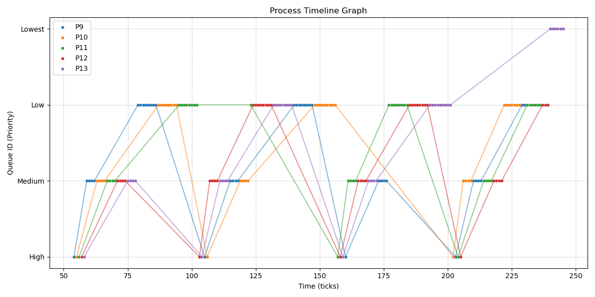
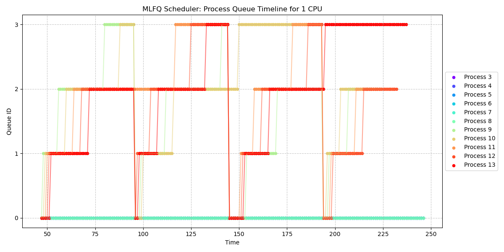

# XV6

### System Calls

> How to define a system call in XV6 ?

* kernel/syscall.h

```c
#define SYS_getSysCount  24
```

* kernel/syscall.c

```c
static uint64 (*syscalls[])(void) = {

[SYS_getSysCount] getSysCount,

};
```

```c
extern uint64 getSysCount(void);
```

* kernel/sysproc.c

```c
uint64
getSysCount(void){

}

```

* user/usys.pl

```c
entry("getSysCount");
```

* user/user.h

```c
int getSysCount(int mask);
```

> How to add a user program in XV6 ?

* make a file say "syscount.c" in the user folder
* Makefile

```Makefile
$U/_syscount\
```

## 1. Gotta count ‘em all [7 points]

* proc.h

```c
struct proc{
    int syscall_count[32];
}
```

* exec() in exec.c

```c
// initisalising the syscall_count array back to 0;
// ***************************************
  for(int i=0;i<NPROC;i++){
    for(int j=0;j<MAX_SYS_CALLS+1;j++){
      proc[i].syscall_count[j]=0;
    }
  }
//***************************************
```

* syscall.c

```c


syscall(void)
{
  int num;
  struct proc *p = myproc();

  num = p->trapframe->a7;

  if(num > 0 && num < NELEM(syscalls) && syscalls[num]) {
   
    p->syscall_count[num]++; // incrementing the syscall 


    p->trapframe->a0 = syscalls[num]();
  } else {
    printf("%d %s: unknown sys call %d\n",
            p->pid, p->name, num);
    p->trapframe->a0 = -1;
  }
}
```

* wait() in kernel/proc.c
> The number of times the corresponding system call is called by the children of the process called with syscount should also be added to the same total
```c
 if (pp->parent == p)
      {
        // make sure the child isn't still in exit() or swtch().
        // *****************************************************
        for (int x = 0; x < MAX_SYS_CALLS + 1; x++)
        {
          p->syscall_count[x] += pp->syscall_count[x];
        }
        // *****************************************************
      }
```

## 2. Wake me up when my timer ends [13 points]


<mark> Run alarmtest to test your sigalarm and sigreturn</mark>
* proc.h : add the following variables in your proc struct
```c
  uint64 interval;
  uint64 handler_func;
  struct trapframe *initital_trapframe;
  uint64 CPUticks;
```

* sigalarm() and sigreturn() syscall in sysproc.c

* trap.c

```c
if (which_dev == 2){
    // *******************alarm*****************************
    if(p->interval>0){
      if(p->CPUticks>=p->interval){
        p->CPUticks=p->interval;
        p->interval=0;
        p->initital_trapframe=(struct trapframe * )kalloc();
        memmove(p->initital_trapframe,p->trapframe,sizeof(struct trapframe));

        p->trapframe->epc = p->handler_func;
      }else{
        p->CPUticks++;
      }
    }
    // ********************alarm*********************************
    yield();
  }
```

* alocproc() in proc.c

```c
  p->interval = 0;
  p->handler_func = 0;
  p->CPUticks = 0;
```

### SCHEDULING

## 1. The process powerball [15 points] (LBS)

* proc.h
```c
struct proc{
    int tickets;
}
```

* allocproc() in kernel/proc.c

```c
if (p->parent)
  {
    p->tickets = p->parent->tickets;
  }
  else
  {

    p->tickets = 1;
  }
```

* scheduler() in kernel/proc.c

```c
#ifdef LBS

#endif

```

* make settickets() syscall

```c
uint64
settickets(void){
  int ticketValue;
  argint(0,&ticketValue);
  if(ticketValue<0){
    return -1;
  }
  struct proc * curr_proc=myproc();
  curr_proc->tickets=ticketValue;
  
  return 0;
}  
```

## 2. MLF who? MLFQ! [25 points]

* kernel/proc.h

```c
  int qNo;  // stores queue no
  int qEntry; // stores entry time in a queue
  int timeslice; // stores time slice of the given queue
  int totalTime;
```

* allocproc() in kernel/proc.c

```c
  p->qNo = 0;
  p->timeslice = TIMESLICE0;
  p->qEntry = ticks;
  p->totalTime = 0;
```

* scheduler() in kernel/proc.c

```c
#ifdef MLFQ

#endif
```

* wakeup() in kernel/proc.c

```c
 if (p->state == SLEEPING && p->chan == chan)
      {
        // **************MLFQ********************
          p->qEntry=ticks;
        // **************MLFQ****************
        p->state = RUNNABLE;
      }
```

* usertrap() in kernel/trap.c  [lowering the priorty]

```c
 #ifdef MLFQ

     p->totalTime++;
     if (p->totalTime >= p->timeslice)
      {
        if (p->qNo == 0)
        {
          p->qNo = 1;
          p->timeslice = TIMESLICE1;
        }
        else if (p->qNo == 1)
        {
          p->qNo = 2;
          p->timeslice = TIMESLICE2;
        }
        else if (p->qNo == 2)
        {
          p->qNo = 3;
          p->timeslice = TIMESLICE3;
        }
       
        p->totalTime = 0;
        p->qEntry = ticks;
        yield();
      }
#else
    yield();
    #endif
```

* usertrap() in kernel/trap.c [priorty boost]

```c
 #ifdef MLFQ
    printf("ticks: %d pid: %d priority %d\n", ticks, p->pid, p->qNo);
     if (boosttime >= BOOSTTIME)
    {
       for(int i=0;i<NPROC;i++){
      p=&proc[i];
      if(p->state!=RUNNABLE){
        continue;
      }
      acquire(&p->lock);
      
          p->qNo = 0;
          p->timeslice = 1;
          
    
      release(&p->lock);

    }
      boosttime = 0;
    }
    else
    {
      boosttime++;
    }

    #endif

```

* wakeup() in kernel/proc.c [putting these process in the same queue but at last]

```c
  if (p->state == SLEEPING && p->chan == chan)
      {
        // **************MLFQ********************
          p->qEntry=ticks;
        // **************MLFQ****************
        p->state = RUNNABLE;
      }
```


## Performance Comparison

### performance

#### RR

* Average rtime 14,  wtime 158
* Average rtime 14,  wtime 158

* Average rtime 14,  wtime 157

* Average rtime 15,  wtime 159
* Average rtime 15,  wtime 160


#### LBS

* Average rtime 14,  wtime 153
* Average rtime 14,  wtime 149
* Average rtime 13,  wtime 149
* Average rtime 18,  wtime 170
* Average rtime 13,  wtime 149

#### MLFQ

* Average rtime 14,  wtime 153
* Average rtime 14,  wtime 155
* Average rtime 13,  wtime 150
* Average rtime 14,  wtime 154
* Average rtime 14,  wtime 153

### powersaver mode

#### RR
* Average rtime 46,  wtime 284
* Average rtime 43,  wtime 272
* Average rtime 41,  wtime 265
* Average rtime 43,  wtime 273
* Average rtime 46,  wtime 282


#### LBS
* Average rtime 42,  wtime 264
* Average rtime 42,  wtime 266
* Average rtime 45,  wtime 275
* Average rtime 44,  wtime 268
* Average rtime 45,  wtime 265

#### MLFQ
* Average rtime 44,  wtime 270
* Average rtime 44,  wtime 276
* Average rtime 43,  wtime 268
* Average rtime 44,  wtime 269
* Average rtime 45,  wtime 278


## Answer the following in 3-4 lines, and optionally provide an example: What is the implication of adding the arrival time in the lottery based scheduling policy? Are there any pitfalls to watch out for? What happens if all processes have the same number of tickets?


#### * In lottery-based scheduling, adding arrival time ensures fairness by giving earlier-arriving processes a higher chance of being scheduled sooner.
#### * However, pitfalls include potential starvation of late-arriving processes if early ones continue holding more tickets. 
#### * If all processes have the same number of tickets, LBS becomes FCFS

--- 

### MLFQ ANALYSIS

## performance mode




## powersaver mode


# xv6
# LAZY Fork (25 marks)

* add cow flag in kernel/riscv.h

```c
#define PTE_COW (1L << 5) // copy-on-write
```

* define addReference(void*) , copyndecref(void*), pagefhandler(pagetable_t ,uint64) in kernel/defs.h

```c
void            cow_incref(void*);
void*           cow_decref(void*);
int             cow_handler(pagetable_t ,uint64);
void            cow_init();
```

* define a struct  which stores the number of processes which are referring to a page of memory in read-only manner.

```c
struct {
  struct spinlock lock;
  int ref[MAXREF];
} cow_ref;
```

* define the following macros in kernel/memlayout.h

```c
#define PA2REF(pa) ((((uint64)pa))/PGSIZE)
// gives us the index of the physical page we are referencing to
#define MAXREF PA2REF(PHYSTOP)
// PHYSTOP is the max limit of physical memory
```

* kernel/main.c

```c
  cow_init();
```

* void cow_incref(void* pa) in kernel/kalloc.c
```c
void cow_incref(void* pa){
  int ref = PA2REF(pa);
  if(ref < 0 || ref >= MAXREF)
    return;
  acquire(&cow_ref.lock);
  cow_ref.ref[ref]++;
  release(&cow_ref.lock);
}
```

* add cow_decref(void* pa) in kernel/kalloc.c
```c
// decrements the reference count and copies memory
void *cow_decref(void *pa)
{
  int index = getIndex(pa);
  if(index == -1){
    return 0;
  }

  acquire(&cow_ref.lock);
  if (cow_ref.ref[index] <= 1)
  {
    release(&cow_ref.lock);
    return pa;
  }

  cow_ref.ref[index] = cow_ref.ref[index] - 1;

  uint64 copymem = (uint64)kalloc();
  if (copymem == 0)
  {
    release(&cow_ref.lock);
    return 0;
  }
  memmove((void *)copymem, (void *)pa, PGSIZE);
  release(&cow_ref.lock);
  return (void *)copymem;
}
```

* add cow_handler function in kernel/kalloc.c
```c
int cow_handler(pagetable_t pagetable, uint64 va)
{
  if (va >= MAXVA || va <= 0)
    return -1;
  // finds the page table entry corresponding to the va
  pte_t *pte = walk(pagetable, va, 0);
  if (pte == 0)
  {
    return -1;
  }

  // is the page valid
  if(!(*pte & PTE_V)){
    return -1;
  }
  // is the page in user space
  if(!(*pte & PTE_U)){
    return -1;
  }
  // is the page a cow page
  if(!(*pte & PTE_COW)){
    return -1;
  }
 
  uint64 pa = PTE2PA(*pte);
  // void *mem = cow_decref((void *)pa);
  char*mem = kalloc();
  if (mem == 0)
    return -1;

  memmove(mem, (char *)pa, PGSIZE);
  

 
    
  uint64 flags = PTE_FLAGS(*pte);
  flags |= PTE_W; // addding write flag
  flags &= (~PTE_COW); // removing cow flag

  uvmunmap(pagetable, PGROUNDDOWN(va), 1, 1);
  if (mappages(pagetable, va,1 , (uint64)mem, flags) == -1)
  {
    panic("Pagefhandler mappages");
  }

  return 0;
}
```

* usertrap() in kernel/trap.c

```c
else if(r_scause() == 15){

    // Handling the page fault
    if(killed(p))
      exit(-1);
    uint64 va = PGROUNDDOWN(r_stval());
     // Going to the start of the page which cause Page Fault Exception
    if(cow_handler(p->pagetable,va) < 0){
      p->killed = 1;
    }
  }
```

* uvmcopy() in kernel/vm.c
```c
// copies the page table of the parent process to its child's page table , instead of allocating new pages to child
int
uvmcopy(pagetable_t old, pagetable_t new, uint64 sz)
{
  pte_t *pte;
  uint64 pa, i;
  uint flags;
  // char *mem;

  for(i = 0; i < sz; i += PGSIZE){
    if((pte = walk(old, i, 0)) == 0)
      panic("uvmcopy: pte should exist");
    if((*pte & PTE_V) == 0)
      panic("uvmcopy: page not present");
    pa = PTE2PA(*pte);

    *pte = (*pte & ~PTE_W) | PTE_COW; // add cow flag and remove write flag

    flags = PTE_FLAGS(*pte);
    // if((mem = kalloc()) == 0)
    //   goto err;
    // memmove(mem, (char*)pa, PGSIZE);
    if(mappages(new, i, PGSIZE,pa, flags) != 0){
      // kfree(mem);
      goto err;
    }
    cow_incref((void*)pa);
  }
  return 0;

 err:
  uvmunmap(new, 0, i / PGSIZE, 1);
  return -1;
}
```

* copyout() in kernel/vm.c

```c
int
copyout(pagetable_t pagetable, uint64 dstva, char *src, uint64 len)
{
  uint64 n, va0, pa0;
    cow_handler(pagetable,dstva); // Makes page fault exception if it is a cow page
  while(len > 0){
    va0 = PGROUNDDOWN(dstva);
    pa0 = walkaddr(pagetable, va0);
    if(pa0 == 0)
      return -1;
    n = PGSIZE - (dstva - va0);
    if(n > len)
      n = len;
    memmove((void *)(pa0 + (dstva - va0)), src, n);

    len -= n;
    src += n;
    dstva = va0 + PGSIZE;
  }
  return 0;
}
```

* kfree() in kernel/kalloc.c
```c
void kfree(void *pa)
{
  struct run *r;

  int index = PA2REF(pa);

  if (((uint64)pa % PGSIZE) != 0 || (char *)pa < end || (uint64)pa >= PHYSTOP)
    panic("kfree");

  acquire(&cow_ref.lock);
  cow_ref.ref[index]--;
  if (cow_ref.ref[index] > 0)
  {
    release(&cow_ref.lock);
    return;
  }
  release(&cow_ref.lock);

  // Fill with junk to catch dangling refs.
  memset(pa, 1, PGSIZE);

  r = (struct run *)pa;

  acquire(&kmem.lock);
  r->next = kmem.freelist;
  kmem.freelist = r;
  release(&kmem.lock);
}

```

* kalloc() in kernel/kalloc.c

```c
void *
kalloc(void)
{
  struct run *r;

  acquire(&kmem.lock);
  r = kmem.freelist;
  if (r)
    kmem.freelist = r->next;
  release(&kmem.lock);

  if (r)
  {

    memset((char *)r, 5, PGSIZE); // fill with junk
    cow_ref.ref[PA2REF((uint64)r)] = 1;
  }
  return (void *)r;
}
```

#  Copy-On-Write (COW) Fork Performance Analysis

### Page Fault Frequency:

```
$ lazytest
simple: Process 21 had 0 page faults
ok
simple: Process 22 had 0 page faults
ok
three: Process 23 had 4096 page faults
Process 24 had 6554 page faults
ok
three: Process 25 had 4096 page faults
Process 26 had 6554 page faults
ok
three: Process 27 had 4096 page faults
Process 28 had 6554 page faults
ok
file: Process 30 had 1 page faults
Process 29 had 1 page faults
Process 31 had 1 page faults
Process 32 had 1 page faults
ok
ALL COW TESTS PASSED
Process 20 had 24592 page faults
```

```
$ testReadOnly
simple: Process 4 had 0 page faults
ok
```

```
$ testModifyMemory
simple: Process 6 had 1 page faults
ok
```

### Brief Analysis

> Discuss the benefits of COW fork in terms of efficiency and memory conservation 

Memory Efficiency:

* Traditional fork() creates a full copy of the parent process's memory space for the child process, which can be expensive if the child does not modify most of this memory.

* COW fork avoids this by allowing the parent and child processes to share the same physical memory pages initially. Instead of copying memory, the operating system marks the pages as read-only and uses reference counting. If either process attempts to write to a shared page, only then is a new copy of the page created.

* This results in significant memory savings, especially for processes with large memory footprints or those that primarily read from memory without modifying it.

Improved Performance:

  * Since COW fork() skips the immediate copying of memory pages, it is much faster than a traditional fork() for processes that may not need to write to their memory space immediately.

  * This can be particularly beneficial in scenarios where a process uses fork() to create a child process that will immediately execute a different program using exec(). The child process in such cases does not need the memory space of the parent, so copying it would be wasteful.

  * Additionally, this technique reduces page faults and cache misses, leading to better CPU cache utilization.

> provide a few sentences on any areas where COW could be further optimized.

Page Sharing Granularity:

* COW works at the page level, which means that even if only a small portion of a page is modified, a full new page is allocated. Sub-page-level COW could potentially conserve memory further, although it would require more complex management and may have performance trade-offs.

Delayed Copy-on-Write:

* Deferred page allocation techniques could be employed, where instead of creating a new page on the first write, the system could wait to see if multiple writes happen. This could be beneficial in reducing page faults in workloads that write in bursts.


